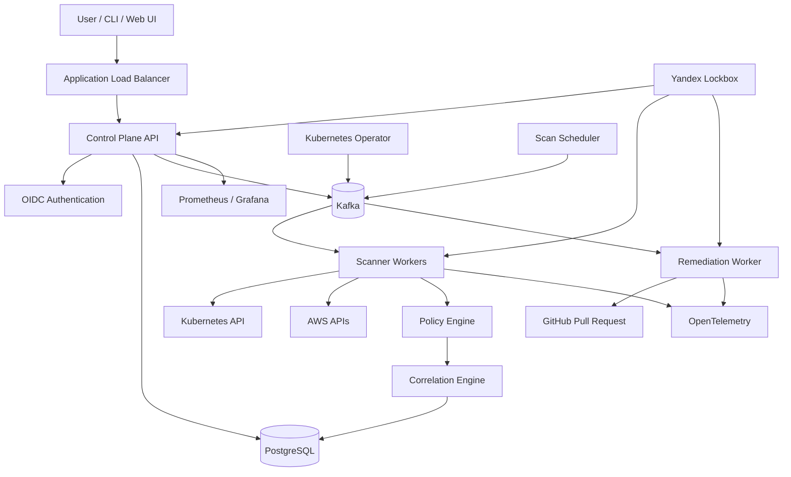

# Техническое задание

## Cloud Security Control Plane

### 1. Назначение проекта

Cloud Security Control Plane — сервис централизованного анализа конфигураций Kubernetes и облачной инфраструктуры.

Система подключается к Kubernetes-кластерам и AWS-аккаунтам, собирает конфигурацию ресурсов, выполняет security-анализ, создаёт findings с severity, evidence и remediation, а также может автоматически сформировать pull request с исправлением.

Главной частью проекта является собственный программный код:

* scanner engine;
* система security rules;
* correlation engine;
* Kubernetes controller;
* REST API;
* CLI;
* система заданий;
* механизм remediation;
* permission model;
* обработка ошибок, retries и dead-letter queue.

Готовые security-инструменты используются только как дополнительные источники информации и не заменяют собственный scanner engine.

---

# 2. Цели

Проект должен демонстрировать:

* Go-разработку;
* Kubernetes internals;
* cloud security;
* DevSecOps;
* Kafka и event-driven architecture;
* работу с PostgreSQL;
* Terraform;
* RBAC и OIDC;
* observability;
* отказоустойчивость;
* system design;
* автоматическое исправление misconfigurations;
* threat modeling;
* CI/CD security.

---

# 3. Границы первой версии

## В MVP входит

* подключение Kubernetes-кластера;
* discovery ресурсов;
* ручной и периодический scan;
* собственный policy engine;
* не менее 15 security checks;
* REST API;
* CLI;
* PostgreSQL;
* Kafka;
* Kubernetes Operator;
* OIDC;
* project-level RBAC;
* findings lifecycle;
* correlation engine;
* генерация remediation;
* создание GitHub pull request;
* Prometheus metrics;
* OpenTelemetry traces;
* Helm chart;
* Terraform для Yandex Cloud;
* threat model;
* unit, integration и end-to-end tests.

## В MVP не входит

* полноценная поддержка всех AWS-сервисов;
* Azure и GCP;
* автоматическое применение исправлений непосредственно в production-кластере;
* собственный язык политик;
* machine learning;
* billing;
* полноценный web-интерфейс уровня коммерческого продукта;
* настоящий global multi-region production deployment.

---

# 4. Технологический стек

## Основной стек

* Go 1.24+;
* PostgreSQL;
* Apache Kafka в KRaft mode;
* Strimzi Kafka Operator;
* Kubernetes;
* controller-runtime;
* Helm;
* Terraform;
* OpenTelemetry;
* Prometheus;
* Grafana;
* Yandex Lockbox;
* Yandex Container Registry;
* GitHub Actions.

## Дополнительные инструменты

* Trivy;
* Semgrep;
* Gitleaks;
* Syft;
* Grype или Trivy SBOM;
* Cosign;
* golangci-lint;
* govulncheck;
* Testcontainers;
* kind.

OPA/Kyverno могут использоваться для сравнения результатов, но не должны быть основным scanner engine.

---

# 5. Архитектура



---

# 6. Компоненты системы

## 6.1 Control Plane API

Отвечает за:

* регистрацию пользователей;
* организации и проекты;
* подключение кластеров;
* запуск scans;
* просмотр findings;
* suppress и acknowledge findings;
* запуск remediation;
* управление пользователями и ролями;
* health checks;
* audit events.

API реализуется на Go.

Рекомендуемые библиотеки:

* `chi` или `gin`;
* `pgx`;
* `sqlc`;
* `go-playground/validator`;
* OpenTelemetry SDK;
* `segmentio/kafka-go` или `franz-go`.

---

## 6.2 Kubernetes Operator

Operator должен использовать `controller-runtime`.

Создаваемые CRD:

### ClusterConnection

Хранит описание подключённого Kubernetes-кластера.

```yaml
apiVersion: security.example.io/v1alpha1
kind: ClusterConnection
metadata:
  name: demo-cluster
spec:
  projectID: project-001
  mode: agent
  scanInterval: 30m
  namespaces:
    include:
      - "*"
    exclude:
      - kube-system
```

### ScanJob

Запускает полный или выборочный scan.

### SecurityPolicy

Включает или отключает определённые security rules.

### RemediationRequest

Запрашивает подготовку автоматического исправления.

Operator не должен содержать основную scanner-логику. Он отвечает за reconciliation, регистрацию кластера, запуск заданий и передачу событий в Kafka.

---

## 6.3 Scanner Engine

Scanner Engine является центральной частью проекта.

Каждое правило реализует общий интерфейс:

```go
type Rule interface {
    ID() string
    Metadata() RuleMetadata
    Supports(obj Object) bool
    Evaluate(ctx context.Context, obj Object, graph ResourceGraph) ([]Finding, error)
}
```

RuleMetadata содержит:

* rule ID;
* title;
* description;
* severity;
* category;
* affected resource types;
* remediation text;
* references;
* supported platforms;
* MITRE ATT&CK mapping;
* CIS Kubernetes Benchmark mapping.

Scanner должен поддерживать:

* параллельный анализ;
* ограничение concurrency;
* context cancellation;
* timeout на правило;
* recovery после panic отдельного правила;
* дедупликацию findings;
* idempotent scans;
* incremental scan;
* full scan;
* structured errors;
* retryable и non-retryable errors.

---

# 7. Kubernetes security rules

В первой версии реализовать минимум следующие проверки.

## Containers

1. Контейнер запущен с `privileged: true`.
2. Разрешён `allowPrivilegeEscalation`.
3. Контейнер может работать от root.
4. Не настроен `runAsNonRoot`.
5. Используется `hostPID`.
6. Используется `hostIPC`.
7. Используется `hostNetwork`.
8. Подключён опасный `hostPath`.
9. Добавлены capabilities `SYS_ADMIN`, `NET_ADMIN`, `SYS_PTRACE`.
10. Не удалены default Linux capabilities.
11. Не настроен seccomp profile.
12. Используется image tag `latest`.
13. Image загружается из недоверенного registry.
14. Не заданы CPU/RAM limits.

## Kubernetes networking

15. Namespace не имеет default-deny NetworkPolicy.
16. Service типа `LoadBalancer` опубликован без allowlist.
17. Используется публичный `NodePort`.
18. Ingress не использует TLS.
19. Административный endpoint опубликован в интернет.

## RBAC

20. Role или ClusterRole содержит wildcard permissions.
21. ServiceAccount имеет доступ к Secrets без необходимости.
22. Workload использует `default` ServiceAccount.
23. ServiceAccount связан с `cluster-admin`.
24. Разрешён `pods/exec`.
25. Разрешено создание `rolebindings` или `clusterrolebindings`.
26. ServiceAccount может создавать privileged workloads.

## Secrets

27. Secret передаётся через environment variable.
28. Secret доступен из нескольких несвязанных namespaces.
29. ServiceAccount имеет возможность читать все Secrets.
30. Secret не используется ни одним workload.

По умолчанию система не должна читать plaintext-значения Kubernetes Secrets. Анализируются metadata, references, RBAC permissions и способы подключения Secret к workload.

Чтение содержимого Secret разрешается только в отдельном explicit opt-in режиме.

---

# 8. Correlation Engine

Correlation Engine должен находить не только отдельные misconfigurations, но и цепочки риска.

Для каждого кластера строится ориентированный граф.

## Типы вершин

* Namespace;
* Workload;
* Container;
* Service;
* Ingress;
* ServiceAccount;
* Role;
* ClusterRole;
* RoleBinding;
* ClusterRoleBinding;
* Secret;
* ConfigMap;
* Node;
* External Endpoint.

## Типы рёбер

* `exposes`;
* `runs-as`;
* `bound-to`;
* `can-read`;
* `can-write`;
* `can-create`;
* `mounts`;
* `belongs-to`;
* `can-exec`;
* `can-escalate`;
* `accessible-from-internet`.

## Пример attack path

```text
Public Ingress
    → Deployment
    → ServiceAccount
    → ClusterRoleBinding
    → ClusterRole with wildcard permissions
    → cluster-admin equivalent access
```

Для поиска опасных путей применяется модифицированный weighted shortest-path algorithm.

Каждому ребру назначается risk weight:

* public exposure: 10;
* privileged workload: 8;
* secret read: 6;
* pods/exec: 7;
* role binding creation: 9;
* cluster-admin: 10.

Correlation Engine должен:

* искать пути от external exposure к sensitive permission;
* ограничивать максимальную длину пути;
* устранять циклы;
* объединять связанные findings;
* повышать severity при наличии attack path;
* сохранять evidence path в PostgreSQL.

Пример результата:

```text
CRITICAL: Internet-exposed workload can escalate to cluster-admin

Path:
Ingress/public-api
→ Deployment/api
→ ServiceAccount/api-sa
→ ClusterRoleBinding/api-admin
→ ClusterRole/cluster-admin
```

---

# 9. Severity model

Итоговый score рассчитывается по формуле:

```text
score =
    base_impact
    × exposure_modifier
    × privilege_modifier
    × confidence
```

Параметры:

* `base_impact`: 1–10;
* `exposure_modifier`: 1.0–1.5;
* `privilege_modifier`: 1.0–1.5;
* `confidence`: 0.5–1.0.

Категории:

* 0–2.9: LOW;
* 3–5.9: MEDIUM;
* 6–8.4: HIGH;
* 8.5–10: CRITICAL.

Итоговый score ограничивается значением 10.

---

# 10. Kafka architecture

Kafka используется как основа background job system.

## Topics

```text
scan.requested
scan.started
scan.resource.discovered
scan.completed
scan.failed

finding.created
finding.updated
finding.resolved

remediation.requested
remediation.completed
remediation.failed

audit.events

dead-letter.scan
dead-letter.remediation
```

## Требования

* consumer groups;
* at-least-once delivery;
* idempotent consumers;
* retry topics;
* exponential backoff;
* dead-letter queue;
* correlation ID;
* trace ID в headers;
* graceful shutdown;
* consumer lag metrics.

Ключ Kafka-сообщения:

```text
organization_id/project_id/cluster_id
```

Это позволит сохранять порядок событий внутри одного подключённого кластера.

---

# 11. Findings lifecycle

Статусы finding:

```text
OPEN
ACKNOWLEDGED
SUPPRESSED
REMEDIATION_PENDING
RESOLVED
REOPENED
```

Finding содержит:

* ID;
* organization ID;
* project ID;
* cluster ID;
* scan ID;
* rule ID;
* resource UID;
* resource kind;
* namespace;
* severity;
* score;
* title;
* description;
* evidence;
* remediation;
* first seen;
* last seen;
* status;
* fingerprint.

Fingerprint формируется из:

```text
cluster_id + resource_uid + rule_id + normalized_evidence
```

Это обеспечивает дедупликацию результатов между scans.

---

# 12. REST API

Основные endpoints:

```text
POST   /api/v1/clusters
GET    /api/v1/clusters
GET    /api/v1/clusters/{id}
DELETE /api/v1/clusters/{id}

POST   /api/v1/clusters/{id}/scans
GET    /api/v1/scans/{id}

GET    /api/v1/findings
GET    /api/v1/findings/{id}
PATCH  /api/v1/findings/{id}
POST   /api/v1/findings/{id}/suppress
POST   /api/v1/findings/{id}/acknowledge
POST   /api/v1/findings/{id}/remediate

GET    /api/v1/attack-paths
GET    /api/v1/attack-paths/{id}

GET    /api/v1/audit-events

GET    /health/live
GET    /health/ready
GET    /metrics
```

API должно поддерживать:

* pagination;
* filtering;
* sorting;
* request validation;
* request ID;
* idempotency key;
* rate limiting;
* OpenAPI specification;
* structured error response.

---

# 13. CLI

Название CLI:

```text
cscp
```

Примеры команд:

```bash
cscp auth login

cscp cluster connect \
  --name demo \
  --kubeconfig ~/.kube/config

cscp scan start --cluster demo

cscp findings list \
  --severity high,critical \
  --status open

cscp findings describe finding-123

cscp remediation create finding-123 \
  --repository owner/repository \
  --branch security/fix-finding-123

cscp attack-paths list --cluster demo
```

CLI должен поддерживать:

* human-readable output;
* JSON output;
* YAML output;
* exit codes;
* authentication token cache;
* configuration file;
* shell completion.

---

# 14. Authentication и Authorization

Authentication реализуется через OIDC.

Для локальной среды допускается Keycloak.

Внутренняя permission model должна быть собственной.

## Роли

### Organization Admin

* управление организацией;
* управление пользователями;
* управление проектами;
* просмотр всех findings.

### Project Admin

* подключение кластеров;
* запуск scans;
* управление policies;
* запуск remediation.

### Security Engineer

* просмотр findings;
* acknowledge;
* suppress;
* запуск remediation.

### Viewer

* read-only доступ.

Каждая API-операция должна проверять permission, а не только название роли.

Пример permissions:

```text
cluster:create
cluster:read
cluster:delete
scan:create
finding:read
finding:acknowledge
finding:suppress
remediation:create
policy:update
member:manage
```

---

# 15. Remediation Engine

Remediation Engine не должен по умолчанию изменять работающий кластер.

Он должен:

1. определить источник manifest;
2. найти нужный YAML-файл;
3. построить JSON Patch или YAML patch;
4. создать новую Git branch;
5. изменить manifest;
6. выполнить validation;
7. создать pull request;
8. добавить в PR описание finding и evidence.

В MVP поддержать автоматические исправления для:

* `privileged: true`;
* `allowPrivilegeEscalation`;
* `runAsNonRoot`;
* dangerous capabilities;
* отсутствующего seccomp;
* image tag `latest`;
* отсутствующих resource limits;
* публичного Service;
* wildcard RBAC;
* отсутствующей NetworkPolicy.

Перед созданием PR выполняются:

* YAML parsing;
* Kubernetes schema validation;
* Helm template validation;
* повторный scan изменённого manifest;
* проверка, что исходный finding устранён;
* проверка, что не появились новые critical findings.

---

# 16. Observability

## Metrics

API:

```text
http_requests_total
http_request_duration_seconds
http_requests_in_flight
```

Scanner:

```text
scans_total
scan_duration_seconds
resources_scanned_total
rule_evaluations_total
rule_errors_total
findings_created_total
```

Kafka:

```text
consumer_lag
messages_processed_total
messages_failed_total
dead_letter_messages_total
```

Remediation:

```text
remediation_requests_total
remediation_duration_seconds
pull_requests_created_total
remediation_failures_total
```

## Logging

Все компоненты используют structured JSON logs.

Обязательные поля:

```text
timestamp
level
service
environment
request_id
trace_id
organization_id
project_id
cluster_id
scan_id
finding_id
message
error
```

## Tracing

OpenTelemetry traces должны проходить через:

```text
API request
→ Kafka producer
→ Scanner consumer
→ Policy Engine
→ PostgreSQL
→ Finding event
```

---

# 17. Infrastructure

Terraform должен создавать:

* Yandex VPC;
* private subnets;
* security groups;
* Managed Kubernetes;
* node group;
* Container Registry;
* service accounts;
* IAM bindings;
* Object Storage bucket;
* Lockbox secrets;
* KMS key;
* Application Load Balancer;
* DNS records;
* PostgreSQL — в расширенной конфигурации;
* monitoring resources.

Terraform не должен использовать постоянный static access key, если возможно применить service account impersonation или краткоживущий токен.

---

# 18. Kubernetes deployment

Helm chart должен включать:

* API Deployment;
* Scanner Worker Deployment;
* Remediation Worker Deployment;
* Operator Deployment;
* Service;
* ServiceAccount;
* Roles и RoleBindings;
* ConfigMaps;
* PodDisruptionBudget;
* HorizontalPodAutoscaler;
* NetworkPolicies;
* ServiceMonitor;
* OpenTelemetry Collector;
* migration Job.

Для production profile:

* API: минимум 2 replicas;
* workers: минимум 2 replicas;
* topology spread constraints;
* pod anti-affinity;
* readiness probes;
* liveness probes;
* startup probes;
* resource requests/limits;
* rolling update;
* graceful termination;
* non-root containers;
* read-only root filesystem;
* dropped capabilities;
* seccomp RuntimeDefault.

---

# 19. CI/CD

GitHub Actions pipeline:

## Pull request

1. Go formatting.
2. golangci-lint.
3. Unit tests.
4. Race detector.
5. govulncheck.
6. Semgrep.
7. Gitleaks.
8. Trivy filesystem scan.
9. Terraform fmt.
10. Terraform validate.
11. Checkov или Trivy IaC.
12. Helm lint.
13. Kubernetes manifest validation.
14. Build Docker images.
15. Generate SBOM.
16. Scan image.
17. Integration tests в kind.

## Main branch

1. Build versioned images.
2. Generate SBOM.
3. Sign images with Cosign.
4. Push to Container Registry.
5. Package Helm chart.
6. Deploy to staging.
7. Run smoke tests.
8. Run end-to-end scan.
9. Publish test report.

---

# 20. Testing

## Unit tests

Покрыть:

* rule evaluation;
* fingerprint generation;
* severity calculation;
* graph construction;
* attack path search;
* permission checks;
* Kafka event serialization;
* retry classification;
* remediation patch generation.

## Integration tests

Использовать Testcontainers для:

* PostgreSQL;
* Kafka;
* API;
* workers.

## Kubernetes integration tests

Создавать kind cluster и применять специально уязвимые manifests.

Тест должен проверить:

1. discovery resources;
2. создание scan;
3. detection findings;
4. correlation attack path;
5. сохранение findings;
6. remediation generation.

## Failure tests

Проверить:

* недоступность Kubernetes API;
* Kafka timeout;
* PostgreSQL disconnect;
* падение scanner worker;
* повторную доставку сообщения;
* duplicate event;
* malformed Kubernetes resource;
* timeout security rule;
* GitHub API rate limit.

---

# 21. Non-functional requirements

* API p95 latency менее 300 ms без учёта запуска scan.
* Анализ 1 000 Kubernetes resources менее 60 секунд.
* Не менее 10 параллельных scans.
* Поддержка не менее 100 000 findings в PostgreSQL.
* Все Kafka consumers идемпотентны.
* После повторной доставки события не появляются duplicate findings.
* Graceful shutdown не приводит к потере задания.
* Все credentials хранятся вне Git.
* Все контейнеры работают не от root.
* Все административные действия записываются в audit log.
* Scanner использует read-only Kubernetes permissions, кроме отдельно включённого remediation mode.

---

# 22. Threat model

Threat model выполняется по STRIDE.

Основные угрозы:

* компрометация токена подключённого кластера;
* утечка kubeconfig;
* privilege escalation через scanner ServiceAccount;
* подмена Kafka events;
* duplicate или replay attack;
* SSRF через cluster endpoint;
* injection через Kubernetes object metadata;
* malicious YAML;
* supply-chain attack;
* компрометация remediation GitHub token;
* создание вредоносного pull request;
* tenant isolation failure;
* раскрытие Secrets через logs;
* unauthorized suppression finding.

Для каждой угрозы описываются:

* asset;
* threat actor;
* attack vector;
* impact;
* mitigation;
* residual risk.

---

# 23. Дополнительный networking lab

BGP и GSLB следует вынести в отдельную часть репозитория, а не усложнять ими MVP.

## BGP lab

Развернуть:

* две небольшие VM;
* FRRouting;
* k3s или self-managed Kubernetes;
* MetalLB в BGP mode;
* два BGP peers;
* анонсирование service VIP;
* автоматический withdrawal route при отказе узла.

Продемонстрировать:

* BGP session establishment;
* route advertisement;
* ECMP;
* failover;
* изменение routing table;
* метрики состояния BGP session.

## Load balancing lab

Показать три уровня балансировки:

1. L7 Application Load Balancer перед API.
2. Kubernetes Service между API pods.
3. Kafka consumer group между scanner workers.

Дополнительно настроить:

* HPA;
* readiness-based traffic removal;
* session-independent API;
* load test;
* pod failure simulation.

## GSLB lab

Развернуть два независимых backend endpoint:

* основной Kubernetes-кластер;
* резервный k3s cluster или VM-based deployment.

Реализовать:

* DNS health checks;
* primary/backup routing;
* weighted routing;
* TTL management;
* failover simulation;
* измерение recovery time.

---

# 24. Структура репозитория

```text
cloud-security-control-plane/
├── cmd/
│   ├── api/
│   ├── operator/
│   ├── scanner-worker/
│   ├── remediation-worker/
│   └── cscp/
├── internal/
│   ├── api/
│   ├── auth/
│   ├── permissions/
│   ├── scanner/
│   ├── rules/
│   ├── graph/
│   ├── correlation/
│   ├── findings/
│   ├── remediation/
│   ├── kafka/
│   ├── storage/
│   └── telemetry/
├── pkg/
│   ├── rulekit/
│   ├── events/
│   └── client/
├── operator/
│   ├── api/
│   └── controllers/
├── migrations/
├── deploy/
│   ├── helm/
│   └── manifests/
├── infrastructure/
│   ├── terraform/
│   ├── bgp-lab/
│   └── gslb-lab/
├── test/
│   ├── integration/
│   ├── e2e/
│   └── fixtures/
├── docs/
│   ├── architecture/
│   ├── threat-model/
│   ├── adr/
│   └── demo/
├── .github/workflows/
├── Makefile
├── docker-compose.yml
└── README.md
```

---

# 25. Этапы реализации

## Этап 1. Scanner core

* доменная модель;
* Kubernetes resource normalization;
* Rule interface;
* первые 10 rules;
* CLI local scan;
* JSON report;
* unit tests.

## Этап 2. Control Plane

* REST API;
* PostgreSQL;
* organizations/projects;
* clusters;
* scans;
* findings lifecycle;
* OpenAPI.

## Этап 3. Event-driven processing

* Kafka;
* scheduler;
* workers;
* retries;
* DLQ;
* idempotency;
* metrics.

## Этап 4. Kubernetes Operator

* CRD;
* controller-runtime;
* agent mode;
* periodic scans;
* Helm chart.

## Этап 5. Correlation и remediation

* resource graph;
* attack path algorithm;
* severity recalculation;
* patch generation;
* GitHub pull requests.

## Этап 6. Production engineering

* OIDC;
* permission model;
* Lockbox;
* Terraform;
* monitoring;
* tracing;
* CI/CD security;
* threat model.

## Этап 7. Advanced networking

* Kafka 3-broker cluster;
* BGP lab;
* GSLB lab;
* load testing;
* failure simulation.

---

# 26. Критерии готовности проекта

Проект считается готовым, если:

* кластер подключается через CLI или CRD;
* scan успешно обрабатывает минимум 1 000 ресурсов;
* реализовано минимум 15 собственных rules;
* findings сохраняются и дедуплицируются;
* реализован finding lifecycle;
* correlation engine строит attack paths;
* существует минимум 5 автоматических remediation;
* система создаёт GitHub pull request;
* Kafka работает с retries и DLQ;
* API защищено OIDC;
* permissions проверяются на уровне проекта;
* присутствуют Prometheus metrics и OpenTelemetry traces;
* инфраструктура создаётся Terraform;
* приложение устанавливается одним Helm command;
* CI выполняет SAST, secret scanning, image scanning и tests;
* подготовлены architecture diagram и STRIDE threat model;
* записана демонстрация отказа worker, Kafka retry и автоматического восстановления.
